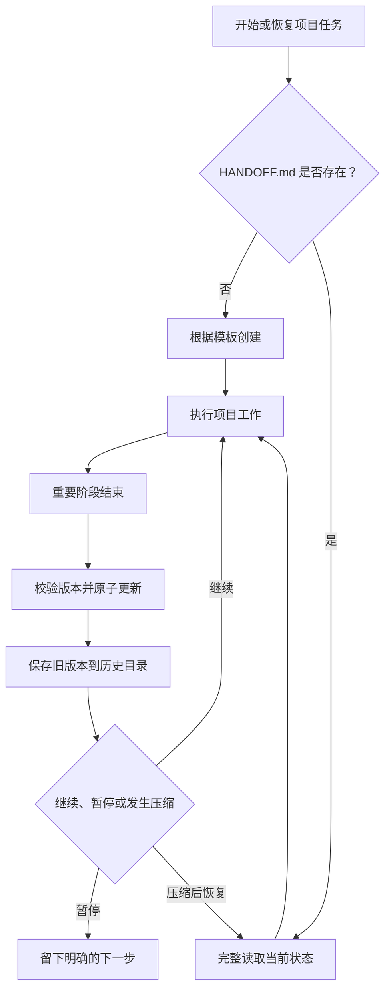

# Project Handoff

> Durable, conflict-safe project checkpoints for AI coding agents.

`project-handoff` 是一个面向 AI 编程助手的项目交接 Skill。它把项目的关键工作状态持续保存在固定文件 `docs/project/HANDOFF.md` 中，让 Agent 在对话被压缩、任务暂停、切换会话或更换 Agent 后，仍然能够从明确且可验证的状态继续工作。

它不是聊天记录备份工具，而是一份简洁的“项目接力本”：只保留继续工作真正需要的目标、边界、决定、进度、证据和下一步。

## 它解决什么问题

长时间使用 AI Agent 处理项目时，常见问题包括：

- 对话上下文压缩后，Agent 忘记之前做过什么；
- 新会话或新 Agent 需要重新扫描整个项目；
- 多个 Agent 同时更新交接信息时互相覆盖；
- 文档写入中断，只留下半份损坏内容；
- 只记录“已经完成”，却没有测试结果等验证证据；
- 交接文档不断堆积，最后变成难以阅读的聊天流水账。

`project-handoff` 用一份结构固定、原子更新、带版本历史的项目状态文档解决这些问题。

## 核心能力

- **项目启动检查**：开始或恢复项目任务时，优先读取 `docs/project/HANDOFF.md`；文件不存在时按模板创建。
- **固定状态结构**：持续维护目标、边界、关键决定、已完成工作、验证证据、当前文件、未完成事项和下一步。
- **阶段性检查点**：重要功能完成、缺陷解决、测试结束、决定确认或任务暂停时，增量刷新项目状态。
- **压缩后恢复**：上下文压缩后，必须先重新读取交接文档，再继续项目推理和修改。
- **并发写入保护**：使用持久文件锁和 SHA-256 compare-and-swap 版本校验，阻止旧状态覆盖其他 Agent 的新状态。
- **原子更新**：先完整写入临时文件并同步到磁盘，再原子替换正式文档，避免只写到一半。
- **历史版本**：自动保留最近 50 个被替换版本，便于检查和恢复。
- **证据优先**：明确区分已完成、已在本地验证、已在外部验证、计划中和受阻状态。
- **敏感信息约束**：禁止把令牌、密码、凭证和不必要的个人信息写进交接文档。

## 工作方式



## 交接文档包含什么

每份 `HANDOFF.md` 固定维护以下八类当前状态：

1. `Project goal`：项目目标；
2. `Scope and boundaries`：工作范围、限制和不能擅自突破的边界；
3. `Key decisions`：已经确认的重要决定；
4. `Completed work`：已经完成的工作；
5. `Verification evidence`：测试命令、构建结果和其他可检查证据；
6. `Current files`：当前阶段最相关的文件；
7. `Open items`：尚未完成、待决定或受阻的事项；
8. `Next step`：下一条可以立即执行的行动。

此外，`Recent updates` 只保留最近的少量里程碑，不把完整对话复制进文档。

## 文件布局

```text
docs/project/
├── HANDOFF.md                         # 唯一的当前权威状态
├── .HANDOFF.lock                      # 多 Agent 写入锁
├── .handoff-precompact-pending.json   # Kimi 压缩后待恢复标记
├── handoff-history/                   # 最近 50 个历史版本
└── handoff-emergency/                 # 压缩前紧急快照
```

## 客户端支持

| 客户端 | 当前状态 | 压缩处理 |
| --- | --- | --- |
| Codex | 已支持 | 项目级强制调用；压缩后首先读取。客户端未提供预告信号时，使用阶段结束和暂停前检查点 |
| Kimi Code CLI | 已支持 | 已提供 `PreCompact` Hook，覆盖手动和自动压缩，并保存紧急快照和待恢复标记 |
| Claude Code、Gemini CLI、GitHub Copilot、Cline、Qwen Code | 计划支持 | 已完成兼容性研究，尚未实现适配器 |
| Cursor、OpenCode、Windsurf、Kiro | 评估或后续支持 | 根据各客户端公开的 Skill 和压缩事件能力采用完整适配或降级方案 |

当前核心更新器使用 Unix `fcntl` 文件锁，因此支持 macOS 和 Linux，尚未完成原生 Windows 兼容。

## 安装到 Codex

要求：Python 3.10 或更高版本。

下载仓库后，把 `project-handoff` 目录复制或链接到 Codex 的 Skills 目录：

```bash
mkdir -p ~/.codex/skills
cp -R project-handoff ~/.codex/skills/project-handoff
```

然后把项目工作区强制调用规则安装到全局 `AGENTS.md`：

```bash
python3 ~/.codex/skills/project-handoff/scripts/install_global_rule.py \
  --agents-file ~/.codex/AGENTS.md
```

安装器只维护带有 `project-handoff` 标记的配置块，不会覆盖文件中的其他规则；重复执行是安全的。

## 接入 Kimi Code CLI

先让 Kimi Code 能够发现本 Skill，再将 `PreCompact` Hook 注册到 Kimi 配置中：

```bash
python3 /absolute/path/to/project-handoff/scripts/install_kimi_hook.py \
  --config-file ~/.kimi-code/config.toml \
  --skill-root /absolute/path/to/project-handoff
```

安装器会原子创建或更新一个受管理的 `PreCompact` 配置块，并保留 `config.toml` 中的其他内容。

Kimi 的 Hook 负责在压缩前保存当前 `HANDOFF.md` 的紧急副本和恢复标记。它不会假装自己能够在 Hook 中重新理解整段对话并智能改写交接文档；语义更新仍然由 Agent 在阶段检查点执行。

## 安全更新

需要手动调用更新器时，先取得当前版本：

```bash
python3 project-handoff/scripts/update_handoff.py revision \
  --project-root /absolute/path/to/project
```

准备好完整的新文档后，带上刚才取得的版本执行更新：

```bash
python3 project-handoff/scripts/update_handoff.py update \
  --project-root /absolute/path/to/project \
  --content-file /absolute/path/to/new-HANDOFF.md \
  --expected-revision <sha256-or-absent>
```

如果其他 Agent 已经抢先更新，命令会报告版本冲突。此时必须重新读取最新文档并合并双方状态，不能直接覆盖。

## 验证

运行完整测试：

```bash
python3 -m unittest discover \
  -s project-handoff/tests \
  -p 'test_*.py'
```

当前实现已覆盖交接文档结构校验、原子替换、并发冲突、文件锁、历史保留、全局规则安装、Kimi Hook 安装和压缩前快照。

## 设计边界

这个项目有意保持以下边界：

- 不保存完整聊天记录；
- 不把交接文档当作长期知识库或语义搜索系统；
- 不自动语义合并两个 Agent 的冲突决定；
- 不提供跨机器的分布式锁；
- 客户端没有真正的压缩事件时，不宣称实现了真正的压缩前检查点；
- 紧急快照是恢复证据，`docs/project/HANDOFF.md` 始终是唯一的当前权威状态。

## 适合谁

如果你正在使用 AI 编程助手处理长周期项目、并行 Agent 任务、跨会话开发或容易触发上下文压缩的大型代码库，`project-handoff` 可以让每一次继续工作都从一份清晰、可验证、不会被半途写坏的项目状态开始。
